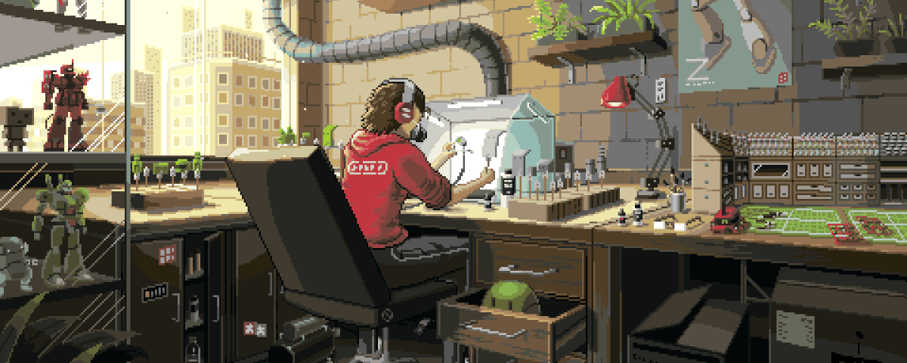

<h1 align="Left">
    </h1> 

 

I am a final-year Informatics student with a strong interest in data analysis and a critical approach to exploring insights within data. I have a solid foundation in cloud computing and am driven by a continuous ambition for professional growth.

- 🔭 I’m currently studying at [Bangkit Academy 2024 Batch 2  - Machine Learning](undefined)
- 🌱 I’m currently learning **Deep Learning AI Tensorflow**
- 📫 You can reach me **[Email](gaaerlang03@gmail.com)**
- ⚡ Laziness kills ambition, Fear kills dreams

## 💻 Tech Stack:
                                                       

## 📊 GitHub Stats:

## 🏆 GitHub Trophies

## 🔝 Top Contributed Repo

## 🌐 Socials:
    

  ## 💰 You can help me by Donating
   

  
<!-- Proudly created with GPRM ( https://gprm.itsvg.in ) -->
